# 🌈 LED Matrix Controller

> [!TIP]
> This project is still in beta, suggestions, feature requests and bug reports are welcome! 

<div align="center">

Transform your space with a **powerful C++ application** that turns RGB LED matrices into stunning digital canvases. Create mesmerizing visual effects, display real-time data, and control everything remotely with our comprehensive plugin ecosystem.

**✨ Perfect for makers, developers, and digital artists ✨**

> **🎯 Recommended:** 128x128 matrix + Raspberry Pi 4 for optimal results!

[](https://github.com/sshcrack/led-matrix/stargazers)
[](https://en.cppreference.com/w/cpp/23)
[](https://www.raspberrypi.org/)
[](https://vscode.dev/redirect?url=vscode://ms-vscode-remote.remote-containers/cloneInVolume?url=https://github.com/sshcrack/led-matrix)

</div>

## 📋 Table of Contents

- [✨ Features](#-features)
- [🔌 Components](#-components)
- [🛠️ Hardware Support](#️-hardware-support)
- [📋 Prerequisites](#-prerequisites)
- [🚀 Quick Start Guide](#-quick-start-guide)
- [🖥️ Desktop App](#️-desktop-app)
- [🎯 Usage Guide](#-usage-guide)
- [🌐 API Reference](#-api-reference)
- [🔧 Troubleshooting](#-troubleshooting)
- [🔌 Plugin Development](#-plugin-development)
- [🤝 Contributing](#-contributing)
- [📄 License](#-license)


## 🎬 Demonstration

Below are some example scenes and effects from the included plugins:

<div align="center">

| AmbientScenes: Clock | AmbientScenes: Starfield | AudioVisualizer: Beat Spectrum | FractalScenes: Game of Life | FractalScenes: Julia Set |
|:-------------------:|:-----------------------:|:----------------------------:|:--------------------------:|:------------------------:|
| 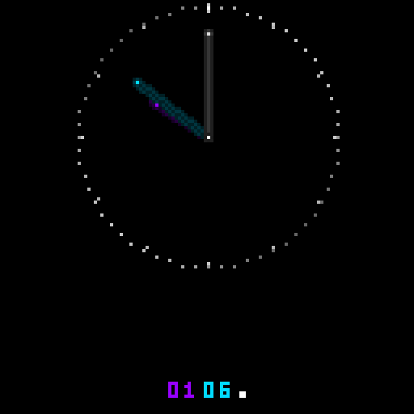 |  | 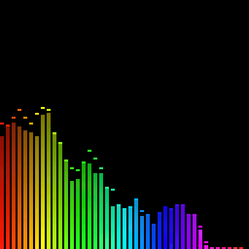 | 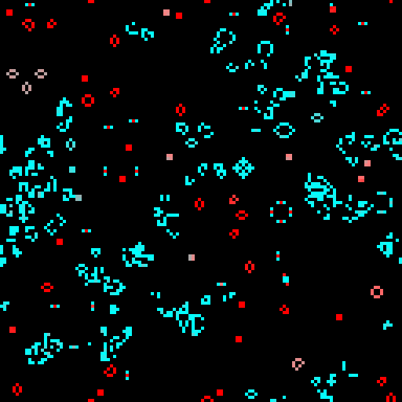 | 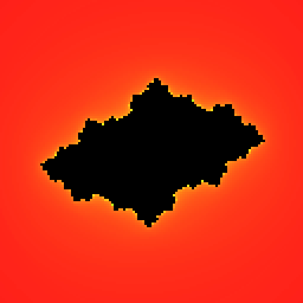 |

| FractalScenes: Wave | GameScenes: Maze | GameScenes: Ping Pong | GameScenes: Snake | GameScenes: Tetris |
|:------------------:|:---------------:|:---------------------:|:----------------:|:-----------------:|
| 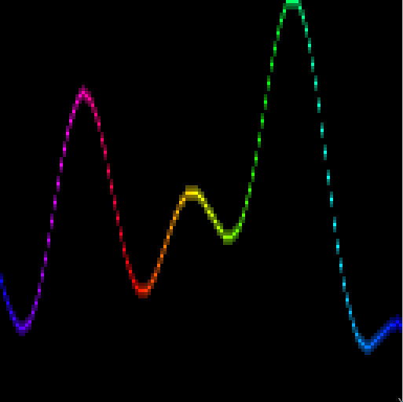 |  | 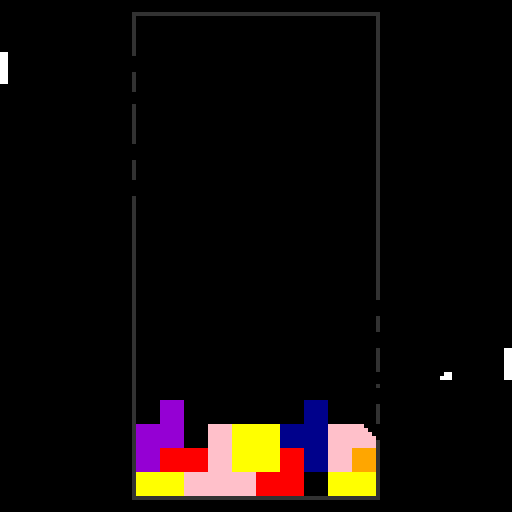 | 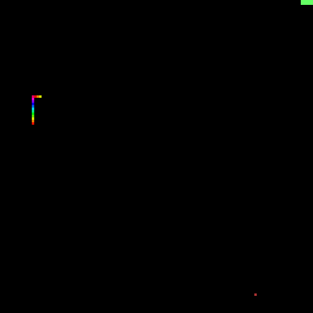 | 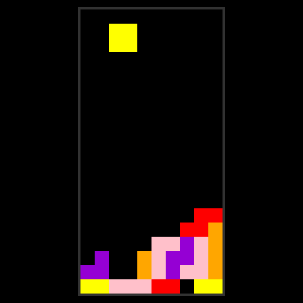 |

| GithubScenes: Watermelon Plasma | GithubScenes: Wave | RGBMatrixAnimations: Rain | RGBMatrixAnimations: Sparks | Shadertoy |
|:------------------------------:|:------------------:|:------------------------:|:--------------------------:|:---------:|
|  |  | 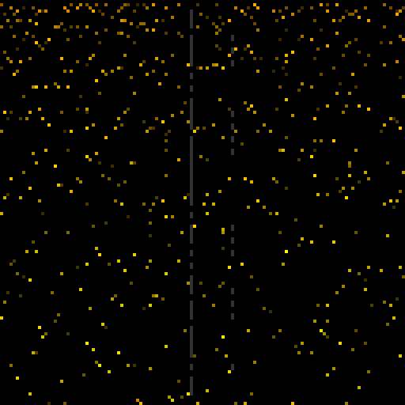 |  |  |

| SpotifyScenes: Cover Only | WeatherOverview: Night Clear |
|:------------------------:|:---------------------------:|
| 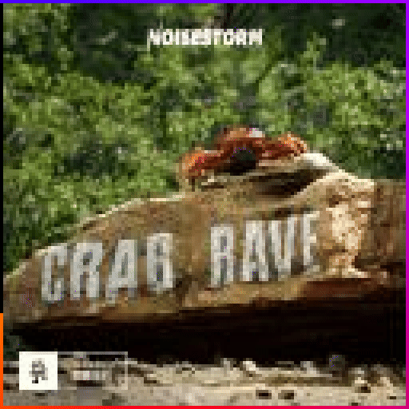 | 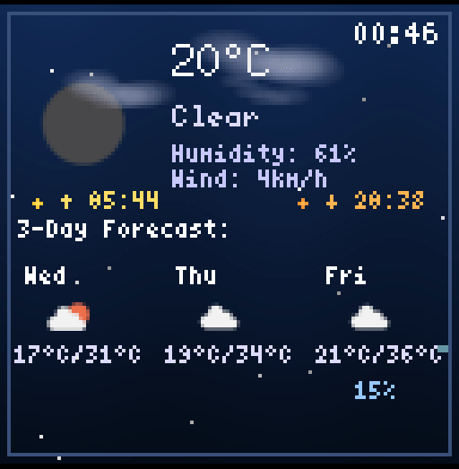 |


</div>

---
## ✨ Features

### 🎮 **Comprehensive Control System**
- **REST API server** for seamless remote control
- **React Native mobile app** and **a website** for on-the-go management  
- **11+ specialized plugins** for unlimited visual variety
- **Preset management** for quick scene switching
- **Advanced scheduling** - Automatically switch presets based on time and day
- **Automatic updates** - Keep your system up-to-date with the latest features and security fixes
- **Real-time configuration** without restarts
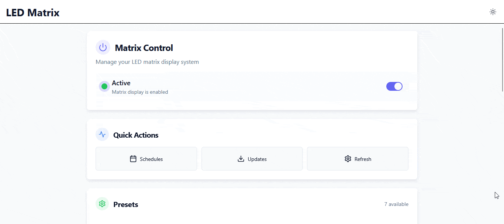

### 🎨 **Rich Plugin Ecosystem**
Our modular plugin architecture delivers an incredible variety of visual experiences across 11+ specialized plugins:

#### 🌟 **AmbientScenes Plugin**
Create mesmerizing atmospheric effects:
- **Starfield** - Simulates twinkling stars
- **Metablob** - Organic fluid animations with flowing, morphing colors
- **Clock** - Elegant digital timepieces with customizable styles

#### 🎵 **SpotifyScenes Plugin**
Music comes alive on your matrix:
- **Album Art Display** - Show current track artwork with smooth transitions
- **Beat-synchronized Effects** - Visual rhythms that pulse with your music
- **Now Playing Info** - Track, artist, and playback status visualization
- **OAuth Integration** - Seamless Spotify account connection
_[Setup required](./plugins/SpotifyScenes/README.md)_

#### 🎮 **GameScenes Plugin**
Interactive entertainment with AI-powered gameplay:
- **Tetris** - Neural network AI plays automatically, optimizing piece placement
- **Ping Pong** - Classic Pong with intelligent AI opponents
- **Maze Generator** - Hunt-and-Kill algorithm creates mazes, A* pathfinding solves them

#### 🧮 **FractalScenes Plugin**
Mathematical beauty in motion:
- **Julia Set** - Animated fractal visualizations with evolving parameters
- **Conways Game of Life**

#### 🌦️ **WeatherOverview Plugin**
Real-world data with style:
- **Live Weather Display** - Current conditions with animated effects
- **Weather Animations** - Visual rain, snow, sunshine effects

#### 💻 **GithubScenes Plugin**
These include scenes, I've found on github:
Watermelonplasma and Wave effects by [Knifa](https://github.com/Knifa/matryx-gl)

#### 🎭 **Shadertoy Plugin**
GPU-powered visual effects:
- **Shader-based Animations** - Renders random (or selected) shaders from shadertoy
- **Real-time Rendering** - Smooth, performance-optimized effects

#### 🎨 **PixelJoint Plugin**
Scrapes the PixelJoint website and displays pixel art

#### 🎆 **RGBMatrixAnimations Plugin**
Physics-based particle systems:
- **Rain Effects** - Realistic precipitation with gravity
- **Spark Systems** - Dynamic particle explosions and trails
- **Gravity Simulations** - Physics-accurate particle behavior

#### 🎵 **AudioVisualizer Plugin**
[Real-time audio analysis](https://github.com/sshcrack/led-matrix/tree/master/plugins/AudioVisualizer):
- **Frequency Spectrum** - Live audio visualization (setup required)
- **Beat Detection** - Intelligent rhythm detection with visual effects
- **Post-Processing Effects** - Flash and rotate effects triggered by beats
- **REST API Control** - Manual effect triggering and configuration
- **Multi-source Audio** - Various input methods supported

#### 🛠️ **ExampleScenes Plugin**
Development foundation:
- **Template Scenes** - Starting point for custom plugin development
- **Reference Implementation** - Best practices demonstration

#### 🌐 **Image & Media**
- **Remote Image Loading** - Display images from URLs with artistic processing
- **Multiple Format Support** - Handle various image types and sizes
- **Dynamic Content** - Real-time image updates and transformations
_(contained within the PixelJoint Scene)_

### 🔧 **Advanced Features**
- **Hardware abstraction** supporting various matrix configurations
- **Cross-compilation support** for efficient Raspberry Pi deployment
- **Emulator support** with SDL2 for development
- **Configurable logging** with spdlog integration
- **Persistent configuration** with JSON-based settings

### ⏰ **Smart Scheduling System**
Take automation to the next level with intelligent preset scheduling:
- **Time-based switching** - Automatically change presets based on time of day
- **Day-of-week scheduling** - Different configurations for weekdays vs weekends
- **Multiple schedules** - Create unlimited schedules for different scenarios
- **Cross-midnight support** - Schedules that span midnight work seamlessly
- **Mobile management** - Create and edit schedules from your phone
- **Real-time activation** - Schedule changes take effect immediately

**Example Use Cases:**
- **Office hours**: Bright, professional displays during work hours (9 AM - 5 PM, weekdays)
- **Evening ambiance**: Warm, relaxing scenes after sunset (6 PM - 11 PM, daily)
- **Weekend fun**: Colorful, dynamic animations on Saturday and Sunday
- **Night mode**: Dim clock display during sleeping hours (11 PM - 7 AM)

## 🔌 Components

### 🖥️ **C++ Backend**
The heart of the system - a high-performance application that orchestrates everything:
- **Scene rendering engine** with smooth animations at 60+ FPS
- **Plugin management** with many loadable plugins
- **Hardware interface** supporting multiple matrix configurations
- **RESTful API server** for external control and integration
- **Configuration persistence** and real-time updates

### 📱 **React Native Mobile App**
A sleek mobile companion for remote control:
- **Intuitive scene selection** with live previews
- **Real-time matrix control** from anywhere on your network
- **Preset management** for quick configuration switching
- **Schedule management** - Create and manage time-based automation
- **Image upload functionality** for custom displays
- Only android for now, I don't have a MacBook unfortunately

Located in the `react-native/` directory with modern TypeScript and native performance.

## 🛠️ **Hardware Support**

> **⚠️ Important:** This project builds upon the excellent [rpi-rgb-led-matrix](https://github.com/hzeller/rpi-rgb-led-matrix) library. For detailed hardware setup, wiring diagrams, troubleshooting, and matrix-specific configuration, please refer to the [comprehensive documentation](https://github.com/hzeller/rpi-rgb-led-matrix) in that repository.

### 🎯 **Recommended Hardware**

> **🌟 Recommended Setup:** For the best experience, we recommend a **128x128 LED matrix** (four 64x64 panels arranged in a 2x2 configuration) paired with a **Raspberry Pi 4**. This setup provides excellent resolution and performance for all visual effects!

- **Raspberry Pi 4** (3B+ minimum) for optimal performance
- **RGB LED matrix panels** with HUB75 interface:
  - **Ideal**: Four 64x64 panels for 128x128 total resolution (multiple 32x32 should also work)
- **Quality power supply** (5V with sufficient amperage - matrices are power-hungry!)
- **[Active-3 Adapter from Electrodragon](https://www.electrodragon.com/product/rgb-matrix-panel-drive-board-raspberry-pi/)**, for alternatives [see here](https://github.com/hzeller/rpi-rgb-led-matrix/blob/master/adapter/README.md). 

Configure your setup using command-line flags or the configuration file - the system adapts automatically!

## 📋 **Prerequisites**

## 🚀 **Quick Start Guide**

### 🚀 **Automatic Installation (Recommended)**

The easiest way to install and configure the LED Matrix Controller is with the provided install script. This script will:
- Download the latest release for your platform
- Guide you through hardware configuration (matrix size, chain, parallel, etc.)
- Optionally set up Spotify integration
- Install the binary to `/opt/led-matrix`
- Set up a systemd service for automatic startup

**To get started, simply run:**

```bash
curl -fsSL https://raw.githubusercontent.com/sshcrack/led-matrix/master/scripts/install_led_matrix.sh | bash
```

Or, if you have already cloned the repository:

```bash
cd scripts
chmod +x install_led_matrix.sh
./install_led_matrix.sh
```

The script will ask you for your matrix configuration and any optional features. After installation, the service will start automatically.
You can now access the LED Matrix control at http://<led_matrix_ip>:8080/

---

## 🖥️ **Desktop App**
The Desktop App is used for compute intensive applications, like the AudioVisualizer or the Shadertoy.

### 📥 **Installation**

#### **Windows**
1. Go to the [Releases page](https://github.com/sshcrack/led-matrix/releases)
2. Download the latest `led-matrix-desktop-*-win64.exe` file
3. Run the installer and follow the setup wizard

#### **Linux**
1. Go to the [Releases page](https://github.com/sshcrack/led-matrix/releases)
2. Download the latest `led-matrix-desktop-*-Linux.tar.gz` file
3. Extract and run:
   ```bash
   tar -xzf led-matrix-desktop-*-Linux.tar.gz
   cd led-matrix-desktop-*
   ./bin/main
   ```

### 🔧 **Usage**
Start the Desktop App, enter your LED Matrix IP address, click "Connect" and you are ready to go!


### 🖥️ **Manual Build & Development**

If you want to build from source or develop locally, follow these steps:

> **💡 Pro Tip:** You can also use our [devcontainer](https://vscode.dev/redirect?url=vscode://ms-vscode-remote.remote-containers/cloneInVolume?url=https://github.com/sshcrack/led-matrix) which has all dependencies installed already!


#### 🔧 **System Requirements**
- **CMake 3.5+** for build system management
- **C++23 compatible compiler** (GCC 12+ or Clang 15+)
- **vcpkg package manager** for dependency management
- **Python 3** with `jinja2` package (`apt install python3-jinja2 -y`)
- **GraphicsMagick** and development headers (`apt install libgraphicsmagick1-dev`)

#### 📱 **For Mobile App Development**
- **Node.js 18+** and npm
- **React Native CLI** and development environment
- **Android Studio** (for Android development)
- **Xcode** (for iOS development on macOS)


#### **Building with CMake Presets (Recommended)**

This project uses CMake presets for easy configuration. Available presets:

- **`cross-compile`** - Build for Raspberry Pi (ARM64)
- **`emulator`** - Build with SDL2 emulator for development
- **`desktop-linux`** - Build desktop app for Linux
- **`desktop-windows`** - Build desktop app for Windows

**For Raspberry Pi:**
```bash
# Configure and build for Raspberry Pi
cmake --preset cross-compile
cmake --build build --target install
```

**For Development/Emulator:**
```bash
# Configure and build emulator version
cmake --preset emulator
cmake --build --preset emulator
```

**For Desktop App:**
```bash
# Linux desktop app
cmake --preset desktop-linux
cmake --build --preset desktop-linux

# Windows desktop app (on Windows)
cmake --preset=desktop-windows
cmake --build --preset desktop-windows
```
#### **Running the Emulator**

Test your scenes without physical hardware using our SDL2-based emulator:

```bash
# Run with emulation (after building with emulator preset)
./scripts/run_emulator.sh
```

Perfect for development, testing, and demonstrations!

### 📱 **Mobile App Setup**

Get the mobile app running in minutes:

1. **Navigate to the app directory:**
   ```bash
   cd react-native
   ```

2. **Install dependencies:**
   ```bash
   pnpm install
   ```

3. **Launch the app:**
   ```bash
   pnpm run dev:android        # For Android
   pnpm run dev:ios            # For iOS
   pnpm run dev:web            # For web
   ```

## 🎯 **Usage Guide**

### 🐌 **Manual Installation**

Download the built binary from GitHub releases (`led-matrix-arm64.tar.gz` for RPI 3 64-bit) and extract it at `/opt/led-matrix`

```bash
sudo ./main [options]
```

> **🔑 Note:** `sudo` is required for GPIO access on Raspberry Pi.

### ⚙️ **Essential Configuration Options**

```bash
# Basic matrix setup
--led-rows=32              # Rows per panel
--led-cols=64              # Columns per panel
--led-chain=2              # Number of chained panels
--led-parallel=1           # Number of parallel chains

# Visual settings
--led-brightness=80        # Brightness (0-100)
--led-pwm-bits=11         # Color depth (1-11)
--led-limit-refresh=120   # Refresh rate limit

# Hardware-specific
--led-gpio-mapping=adafruit-hat    # For Adafruit HAT/Bonnet
--led-slowdown-gpio=1             # Timing adjustment for Pi models
```

> **📖 For comprehensive configuration options**, including troubleshooting flickering displays, timing adjustments, and advanced setups, see the [rpi-rgb-led-matrix documentation](https://github.com/hzeller/rpi-rgb-led-matrix?tab=readme-ov-file#types-of-displays).

### 🗂️ **Configuration Management**

The application uses a smart configuration system:

- **`config.json`** - Automatically created in the application directory
- **Persistent settings** - Scene presets, API configurations, plugin settings
- **Hot-reload support** - Many settings update without restart
- **Backup-friendly** - JSON format for easy version control

### 📊 **Logging System**

Fine-tune logging for development and debugging:

```bash
# Set log level via environment variable
SPDLOG_LEVEL=debug ./main

# Available levels: trace, debug, info, warn, error, critical, off
```

All logs output to console with timestamps and color coding for easy reading.

## 🌐 **API Reference**
_May be out of date_

The REST API provides powerful remote control capabilities at `http://<device-ip>:8080/`.
By default, the main index page will redirect you to the web controller (located at `/web`)

### 📊 **Core Endpoints**

| Method | Endpoint | Description |
|--------|----------|-------------|
| `GET` | `/status` | System status and current state |
| `GET` | `/get_curr` | Current scene information |
| `GET` | `/list_scenes` | Available scenes and plugins |
| `GET` | `/toggle` | Toggle display on/off |
| `GET` | `/skip` | Skip to next scene |

### 🎛️ **Scene Management**

| Method | Endpoint | Description |
|--------|----------|-------------|
| `GET` | `/set_preset?id=<preset_id>` | Switch to specific preset |
| `GET` | `/presets` | List all saved presets |
| `POST` | `/preset?id=<preset_id>` | Create/update preset |
| `DELETE` | `/preset?id=<preset_id>` | Delete preset |

### 🖼️ **Media Control**

| Method | Endpoint | Description |
|--------|----------|-------------|
| `GET` | `/list` | Available local images |
| `GET` | `/image?url=<url>` | Fetch and display remote image |
| `GET` | `/list_providers` | Available image providers |

### ⚙️ **System Control**

| Method | Endpoint | Description |
|--------|----------|-------------|
| `GET` | `/set_enabled?enabled=<true\|false>` | Enable/disable display |
| `GET` | `/list_presets` | Detailed preset information |

### ⏰ **Schedule Management**

| Method | Endpoint | Description |
|--------|----------|-------------|
| `GET` | `/schedules` | List all schedules |
| `GET` | `/schedule?id=<schedule_id>` | Get specific schedule details |
| `POST` | `/schedule?id=<schedule_id>` | Create/update schedule |
| `DELETE` | `/schedule?id=<schedule_id>` | Delete schedule |
| `GET` | `/scheduling_status` | Get scheduling status and active preset |
| `GET` | `/set_scheduling_enabled?enabled=<true\|false>` | Enable/disable scheduling |

### 🎨 **Post-Processing Effects**

| Method | Endpoint | Description |
|--------|----------|-------------|
| `GET` | `/post_processing/flash?duration=<seconds>&intensity=<0-1>` | Trigger flash effect |
| `GET` | `/post_processing/rotate?duration=<seconds>&intensity=<0-2>` | Trigger rotation effect |
| `GET` | `/post_processing/clear` | Clear all active effects |
| `GET` | `/post_processing/status` | Get post-processing system status |
| `GET` | `/post_processing/config` | Get beat detection configuration |

#### **Post-Processing Examples**
```bash
# Quick flash effect
curl "http://matrix-ip:8080/post_processing/flash?duration=0.3&intensity=1.0"

# Slow rotation (720 degrees over 3 seconds)
curl "http://matrix-ip:8080/post_processing/rotate?duration=3.0&intensity=2.0"

# Clear all effects
curl "http://matrix-ip:8080/post_processing/clear"
```

**Beat Detection**: When using the AudioVisualizer plugin, beats are automatically detected from audio input and trigger flash effects. WebSocket clients receive `beat_detected` messages in real-time.

#### **Schedule JSON Format**
```json
{
  "id": "work-hours",
  "name": "Work Hours Display",
  "preset_id": "office-preset",
  "start_hour": 9,
  "start_minute": 0,
  "end_hour": 17,
  "end_minute": 30,
  "days_of_week": [1, 2, 3, 4, 5],
  "enabled": true
}
```

**Days of Week**: `0` = Sunday, `1` = Monday, ..., `6` = Saturday

### 🔄 **Automatic Updates**

| Method | Endpoint | Description |
|--------|----------|-------------|
| `GET` | `/api/update/status` | Get current update status and configuration |
| `POST` | `/api/update/check` | Manually check for available updates |
| `POST` | `/api/update/install` | Install available update (optional: `?version=<version>`) |
| `POST` | `/api/update/config` | Update auto-update configuration |
| `GET` | `/api/update/releases?per_page=<count>` | Get recent GitHub releases |

#### **Update Status Response**
```json
{
  "auto_update_enabled": true,
  "check_interval_hours": 24,
  "current_version": "1.0.0",
  "latest_version": "1.10.0",
  "update_available": true,
  "status": 0,
  "error_message": ""
}
```

**Status Values**: `0`=Idle, `1`=Checking, `2`=Downloading, `3`=Installing, `4`=Error, `5`=Success

#### **Update Configuration**
```json
{
  "auto_update_enabled": true,
  "check_interval_hours": 12
}
```

#### **Update Examples**
```bash
# Check update status
curl "http://matrix-ip:8080/api/update/status"

# Manually check for updates
curl -X POST "http://matrix-ip:8080/api/update/check"

# Install latest update
curl -X POST "http://matrix-ip:8080/api/update/install"

# Install specific version
curl -X POST "http://matrix-ip:8080/api/update/install?version=1.10.0"

# Configure auto-updates
curl -X POST "http://matrix-ip:8080/api/update/config" \
  -H "Content-Type: application/json" \
  -d '{"auto_update_enabled": true, "check_interval_hours": 12}'

# Get recent releases
curl "http://matrix-ip:8080/api/update/releases?per_page=3"
```

**Auto-Update**: When enabled, the system automatically checks for updates at the configured interval (default: 24 hours) and installs them if available. The service restarts automatically after installation. Updates can be managed via the web interface at `/updates`.

## 🔧 **Troubleshooting**

### 🚨 **Common Issues & Solutions**

| Problem | Solution |
|---------|----------|
| **Matrix flickering** | Check power supply amperage - LEDs need significant current. Flickering can also be caused because the RPi has not enough performance |
| **Permission errors** | Run with `sudo` for GPIO access |
| **Slow performance** | Try upgrading your Pi to a newer model or reduce `--led-pwm-bits` |
| **Can't connect to API** | Check firewall and ensure port 8080 is open |
| **Panels not lighting up** | Verify `--led-panel-type` setting |
| **Colors look wrong** | Adjust `--led-multiplexing` settings (try values 0-17) |


> **📚 For hardware-specific issues**, timing problems, or panel compatibility, consult the comprehensive [rpi-rgb-led-matrix troubleshooting guide](https://github.com/hzeller/rpi-rgb-led-matrix#troubleshooting).

## 🔌 **Plugin Development**

Extend the matrix with your own custom scenes and effects! Create powerful plugins that add new visual experiences, integrate external APIs, and provide custom functionality.

### 📖 **Comprehensive Documentation**

For detailed plugin development, check out our **[Complete Plugin Development Guide](docs/PLUGIN_DEVELOPMENT.md)**!

This comprehensive guide covers:
- 🏗️ **Plugin Architecture** - Understanding the modular system
- 🚀 **Quick Start** - Get your first plugin running in minutes
- 📚 **Core APIs** - Detailed documentation of shared libraries
- 🎨 **Scene Development** - Create stunning visual effects
- ⚙️ **Properties System** - Automatic serialization and validation
- 🖼️ **Image Providers** - Custom image sources and processing
- 🎭 **Post-Processing Effects** - Screen-wide effects and transformations
- 🌐 **REST API Integration** - Custom endpoints and remote control
- 💬 **Desktop Communication** - WebSocket messaging and data streaming
- 🔧 **Advanced Features** - Resource loading, lifecycle hooks, and more
- 📦 **Building and Testing** - CMake configuration and emulator testing
- 🎯 **Best Practices** - Performance, error handling, and code organization

### ⚙️ **Advanced Plugin Features**

- **Property system** - Automatic API exposure and persistence with validation
- **Image providers** - Custom image sources and processing
- **Post-processing effects** - Screen-wide effects like flash and rotation
- **REST API endpoints** - Extend the API with custom routes
- **WebSocket communication** - Real-time messaging with desktop clients
- **Resource loading** - Access plugin-specific assets and fonts
- **Lifecycle hooks** - Initialize and cleanup resources properly

### 📚 **Study These Plugin Examples**

- **`ExampleScenes/`** - Simple starting template and basic patterns
- **`AudioVisualizer/`** - Real-time audio analysis and visualization
- **`WeatherOverview/`** - External API integration and animated displays
- **`GameScenes/`** - Interactive content and game logic (Tetris, Pong, Maze)
- **`FractalScenes/`** - Mathematical visualizations and complex algorithms
- **`SpotifyScenes/`** - OAuth integration and music visualization
- **`AmbientScenes/`** - Atmospheric effects and procedural generation

### 🚀 **Get Started**

1. **Read the [Plugin Development Guide](docs/PLUGIN_DEVELOPMENT.md)**
2. **Study existing plugins** for patterns and inspiration
3. **Use the emulator** for development and testing
4. **Share your creations** with the community!

## 🤝 **Contributing**

We welcome contributions! Whether it's a bug fix, new feature, or awesome plugin - join our community.

### 🚀 **Getting Started**

1. **Fork the repository**
2. **Create your feature branch:**
   ```bash
   git checkout -b feature/amazing-new-feature
   ```
3. **Make your changes** with clear, tested code
4. **Commit with descriptive messages:**
   ```bash
   git commit -m 'Add some amazing new feature'
   ```
5. **Push to your branch:**
   ```bash
   git push origin feature/amazing-new-feature
   ```
6. **Open a Pull Request** with detailed description

### 💡 **Contribution Ideas**

- **New scene plugins** - Stocks, social media, ...
- **Performance optimizations** - Faster rendering, lower memory usage
- **Hardware support** - New matrix types, different GPIO mappings
- **Mobile app features** - Better UI, offline mode, advanced controls
- **Documentation** - Tutorials, examples, troubleshooting guides
- **Assembly Guide** - 3D printable models, wiring

### 📋 **Code Standards**

- **C++23 features** encouraged where appropriate
- **Clear variable names** and comprehensive comments
- **Error handling** with `std::expected` where possible
- **Thread safety** for multi-threaded operations

## 📄 **License**
See the [LICENSE](LICENSE) file for details.

### 🙏 **Acknowledgments**

- **[rpi-rgb-led-matrix](https://github.com/hzeller/rpi-rgb-led-matrix)** by Henner Zeller - The foundation that makes this all possible
- **[RGBMatrixAnimations](https://github.com/Footleg/RGBMatrixAnimations)** by Footleg - Particle system animations
- **[Fluent Emoji by Microsoft](https://github.com/microsoft/fluentui-emoji)** - For the crystal ball emoji used as icon for the desktop app
- **[matrix-gl](https://github.com/Knifa/matryx-gl)** and **[RGBMatrixAnimations](https://github.com/Footleg/RGBMatrixAnimations)** for awesome animations
- **Open source community** - For the countless libraries and tools that power this project

---

<div align="center">

**🌟 Star this repo if you found it helpful! 🌟**

Made with ❤️ by sshcrack for the LED matrix community

</div>
