# 🌈 LED Matrix Controller

**One‑line install on a Raspberry Pi (arm64):**
```bash
curl -sSL https://raw.githubusercontent.com/sshcrack/led-matrix/master/scripts/install_led_matrix.sh | bash
```
Downloads the latest `.deb` from GitHub Releases, presents an interactive config dialog (matrix dimensions, Spotify, auto‑updates), and installs the systemd service.

> [!TIP]
> This project is still maintained, but I just don't have any ideas what to do right now, I'm open for suggestions!

<div align="center">

Transform your space with a **powerful C++ application** that turns RGB LED matrices into stunning digital canvases. Create mesmerizing visual effects, display real-time data, and control everything remotely with our comprehensive plugin ecosystem.

**✨ Perfect for makers, developers, and digital artists ✨**

> **🎯 Recommended:** 128x128 matrix + Raspberry Pi 4 for optimal results!

[](https://github.com/sshcrack/led-matrix/stargazers)
[](https://en.cppreference.com/w/cpp/23)
[](https://www.raspberrypi.org/)
[](https://vscode.dev/redirect?url=vscode://ms-vscode-remote.remote-containers/cloneInVolume?url=https://github.com/sshcrack/led-matrix)

</div>

## 📋 Table of Contents

- [✨ Features](#-features)
- [🔌 Components](#-components)
- [🛠️ Hardware Support](#️-hardware-support)
- [📋 Prerequisites](#-prerequisites)
- [🚀 Quick Start Guide](#-quick-start-guide)
- [🖥️ Desktop App](#️-desktop-app)
- [🎯 Usage Guide](#-usage-guide)
- [🌐 API Reference](#-api-reference)
- [🔧 Troubleshooting](#-troubleshooting)
- [🔌 Plugin Development](#-plugin-development)
- [🤝 Contributing](#-contributing)
- [📄 License](#-license)


## 🎬 Demonstration

Selected GIFs from `scene_previews/` (45 pre-generated previews, committed to git). The full gallery is visible in the web UI and via `scene_preview?name=<id>`.

<div align="center">

| AmbientScenes: Clock | AmbientScenes: Starfield | AmbientScenes: Metablob | AmbientScenes: DigitalRain | AmbientScenes: NeonTunnel |
|:-------------------:|:-----------------------:|:----------------------:|:--------------------------:|:-------------------------:|
| 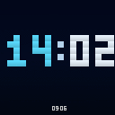 |  | 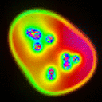 | 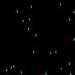 | 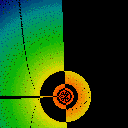 |

| AmbientScenes: Bouncing Logo | AmbientScenes: Sorting Visualizer | FractalScenes: Julia Set | FractalScenes: Game of Life | FractalScenes: Wave Pattern |
|:---------------------------:|:--------------------------------:|:------------------------:|:--------------------------:|:---------------------------:|
| 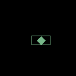 | 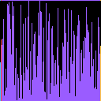 | 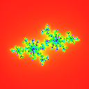 | 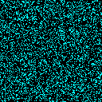 | 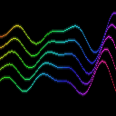 |

| GenerativeScenes: Boids | GenerativeScenes: Falling Sand | GenerativeScenes: Reaction Diffusion | GameScenes: Tetris | GameScenes: Pac-Man |
|:----------------------:|:------------------------------:|:-----------------------------------:|:------------------:|:-------------------:|
| 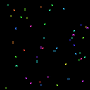 | 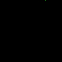 | 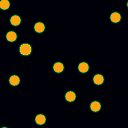 | 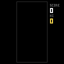 | 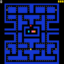 |

| GameScenes: Maze | GameScenes: Ping Pong | GameScenes: Snake | GithubScenes: Watermelon Plasma | GithubScenes: Wave |
|:----------------:|:---------------------:|:-----------------:|:------------------------------:|:------------------:|
|  | 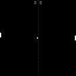 |  |  |  |

| RGBMatrixAnimations: Rain | RGBMatrixAnimations: Sparks | Shadertoy: Plasma Waves | Shadertoy: Ethereal Portal | WeatherOverview: Weather |
|:------------------------:|:--------------------------:|:-----------------------:|:--------------------------:|:------------------------:|
| 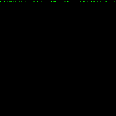 | 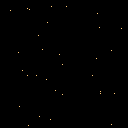 | 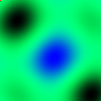 | 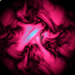 | 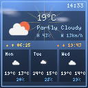 |

| WeatherOverview: Weather Ambience | AudioVisualizer: Spectrum | AudioVisualizer: Aurora | AudioVisualizer: Kaleidoscope | SpotifyScenes: Cover |
|:---------------------------------:|:-------------------------:|:-----------------------:|:-----------------------------:|:--------------------:|
|  | 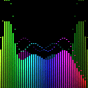 | 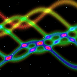 | 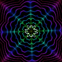 |  |

| PixelJoint: Image Scene | Countdown | **✨ New: Shadertoy Audio-Reactive** | **✨ New: Shadertoy Audio-Reactive** |
|:-----------------------:|:---------:|:-----------------------------------:|:-----------------------------------:|
| 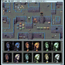 | 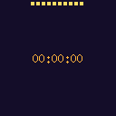 | 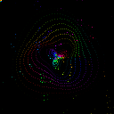 |  |
|  |  | `music_neon_orbit` — neon orbital rings reacting to kick/snare | `music_spectrum_tunnel` — spectrum tunnel with beat-driven warp |

| Shadertoy: Mobius Fluid | Shadertoy: Rainbow Spiral | Shadertoy: Expert Julia | Shadertoy: Realistic Cloth |
|:-----------------------:|:--------------------------:|:-----------------------:|:--------------------------:|
| 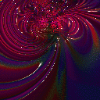 |  | 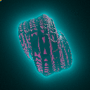 |  |

</div>

> **New in this update:** 5 built-in Shadertoy shaders were added under `plugins/Shadertoy/shaders/` — `music_liquid_ribbons` (flowing ribbons), `music_neon_orbit` (neon orbital rings, featured above as `neon_orbit_tunnel.gif`), `music_spectrum_tunnel` (neon depth tunnel, featured above as `starfield_warp.gif`), `scenic_aurora` (calm aurora flow), `scenic_plasma_garden` (organic plasma). All expose `led-matrix-shader` JSON for Automatic Mode / Music Director. Add your own `.frag` to `plugins/Shadertoy/shaders/` (→ `shader:<name>`) or `data/custom_shaders/` (→ `custom_shader:<name>`) — see `plugins/Shadertoy/SHADER_AUTHORING.md`. The web gallery sources previews from `scene_previews/<scene_id>.gif` deployed to `/usr/share/led-matrix/scene_previews/`.

---
## ✨ Features

### 🎮 **Comprehensive Control System**
- **REST API server** for seamless remote control
- **PWA** and **a website** for on-the-go management
- **18 plugins, 39 scenes, 7 post-processing effects & 11 transitions**
- **Preset management** for quick scene switching
- **Advanced scheduling** - Automatically switch presets based on time and day
- **Automatic updates** - Keep your system up-to-date with the latest features and security fixes
- **Real-time configuration** without restarts
- **Live matrix preview** via pull-based WebSocket (`/live_frame`, `LMF1` frames, coalesced viewers)
- **Adaptive quality & automatic desktop offload** - heavy scenes migrate to the desktop scene worker when the Pi is under pressure
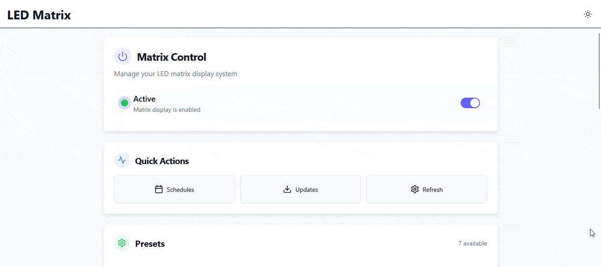

### 🎨 **Rich Plugin Ecosystem — 18 Plugins, 39 Scenes**

> Scene IDs are the values returned by `Scene::get_name()` / `list_scenes` and used for pinning (`--scene <id>`), presets, and previews. Categories match `get_category()`.

| Plugin | Scenes (ID — `Category`) | What it does |
|:-------|:--------------------------|:-------------|
| **AmbientScenes** | `starfield`, `metablob`, `clock`, `sorting-visualizer`, `bouncing-logo`, `neontunnel`, `digitalrain` — `Ambient` | Atmospheric & procedural ambience: warp starfield, metaball fluid, analog/digital clock + date, sorting-algorithm visualizer, DVD-style bouncing logo, neon tunnel, Matrix-style digital rain. |
| **AudioVisualizer** | `audio_spectrum`, `audio_particles`, `audio_pulse_tunnel`, `audio_aurora`, `audio_kaleidoscope`, `music_director` — `Audio Reactive` | Real-time audio analysis via desktop capture: spectrum bars, particle fields, pulse tunnel, aurora, kaleidoscope, and the `music_director` automatic DJ. [Setup required](./plugins/AudioVisualizer/README.md). Audio is also mirrored to the remote scene worker. |
| **GameScenes** | `ping_pong`, `tetris`, `maze`, `snake_game`, `pacman_ai` — `Games` | Self-playing games: Pong (AI opponents), Tetris (neural-net placement), Maze (Hunt-and-Kill + A* solver), Snake, Pac-Man. |
| **FractalScenes** | `julia_set`, `game_of_life`, `wave_pattern` — `Fractals` | Math-driven visuals: animated Julia sets, Conway's Game of Life, wave interference patterns. |
| **GenerativeScenes** | `reaction_diffusion`, `boids`, `falling_sand` — `Generative` | Emergent simulations: Gray-Scott reaction-diffusion, Boids flocking, Falling Sand automata. |
| **GithubScenes** | `watermelon_plasma`, `wave` — `Generative` | Community effects ported from [matryx-gl](https://github.com/Knifa/matryx-gl) (Knifa). |
| **RGBMatrixAnimations** | `rain`, `sparks` — `Particles` | Particle systems: gravity-driven rain and sparks. |
| **Shadertoy** | `shadertoy` (+ dynamic `custom_shader:*` / `shader:*`) — `Shaders` / `Custom Shaders` | Streams Shadertoy shaders rendered on the desktop (`shadertoy` cycles randomly; installed `.frag` files under `shaders/` appear as `custom_shader:<name>` / `shader:<name>` with preview GIFs like `ethereal_portal`, `plasma_waves`). **New:** 5 built-in shaders — `music_liquid_ribbons`, `music_neon_orbit`, `music_spectrum_tunnel` (audio-reactive, `music_affinity=1.0`), `scenic_aurora`, `scenic_plasma_garden` (calm scenic). See `SHADER_AUTHORING.md` for the `iChannel0` music texture + `iAudio*` uniforms. Needs desktop app; `supports_remote_rendering = false`. |
| **WeatherOverview** | `weather`, `weather_ambience` — `Weather` | Live weather dashboard (current icon + forecast + sunrise/sunset + clock) and ambient weather particles (rain/snow/aurora/fog/lightning). Requires network. |
| **SpotifyScenes** | `spotify` — `Media` | Shows current Spotify cover art with transitions. OAuth; deterministic `spotify.playback` preview fixture so previews need no credentials. |
| **SpotifyMV** | `spotifymv` — `Media` | Auto-plays YouTube music videos for the current Spotify track (yt-dlp + ffmpeg on desktop, muted video piped via UDP to Pi; `prepare_runtime` pre-warms while another scene is active). |
| **Video** | `video` — `Media` | Plays URL-sourced video (YouTube etc.) decoded on desktop and streamed to a lightweight Pi proxy. Needs desktop app. |
| **PixelJoint** | `image_scene` — `Images` | Pixel-art & general image provider: `pages` / `collection` / `random` providers scraping PixelJoint; also handles generic URL images. `scene_previews/image_scene.gif` is its preview. |
| **Countdown** | `countdown` — `Utility` | Countdown to a target date with confetti & firework particles, big-digit modes, pulse effects. |
| **ExampleScenes** | `color_pulse`, `property_demo`, `rendering_demo` — `Examples` | Minimal reference scenes for plugin authors (see [Plugin Development Guide](docs/PLUGIN_DEVELOPMENT.md)). |
| **BasicEffects** | *(no scenes — 7 post-processing effects)* `flash`, `rotate`, `glow`, `rgb_split`, `glitch`, `pixelate`, `shockwave` | Screen-wide effects triggerable via `/post_processing/*` or automatically on audio beats. Applied on the Pi even when the scene is remotely rendered. |
| **Transitions** | *(no scenes — 11 transitions)* `blend`, `swipe`, `morph`, `radial_reveal`, `checker_reveal`, `ordered_dissolve`, `random_dissolve`, `glitch_cut`, `crt_collapse`, `block_dissolve`, `zoom_blend` | Transitions between scenes. Configured per-scene via `transition_name` / `transition_duration`. |
| **RenderOffload** | *(infrastructure, no scenes)* | Generic desktop scene worker supervisor (`led-matrix-scene-worker`). Packages worker copies of all portable `scenes/` renderers; Pi offloads based on measured per-scene p50/p95 cost, not a static `heavy` flag. |

**At a glance:** 7 Ambient + 6 AudioVisualizer + 5 GameScenes + 3 FractalScenes + 3 GenerativeScenes + 2 GithubScenes + 2 RGBMatrixAnimations + 2 WeatherOverview + 1 Shadertoy (+ N custom shaders) + 1 SpotifyScenes + 1 SpotifyMV + 1 Video + 1 PixelJoint + 1 Countdown + 3 ExampleScenes = **39 named scenes** (plus dynamically discovered custom shaders). Effects and transitions are separate from scenes and are listed above.

### 🔧 **Advanced Features**
- **Hardware abstraction** supporting various matrix configurations
- **Cross-compilation support** for efficient Raspberry Pi deployment
- **Emulator support** with SDL2 for development
- **Configurable logging** with spdlog integration
- **Persistent configuration** with JSON-based settings

### ⏰ **Smart Scheduling System**
Take automation to the next level with intelligent preset scheduling:
- **Time-based switching** - Automatically change presets based on time of day
- **Day-of-week scheduling** - Different configurations for weekdays vs weekends
- **Multiple schedules** - Create unlimited schedules for different scenarios
- **Cross-midnight support** - Schedules that span midnight work seamlessly
- **Mobile management** - Create and edit schedules from your phone
- **Real-time activation** - Schedule changes take effect immediately

**Example Use Cases:**
- **Office hours**: Bright, professional displays during work hours (9 AM - 5 PM, weekdays)
- **Evening ambiance**: Warm, relaxing scenes after sunset (6 PM - 11 PM, daily)
- **Weekend fun**: Colorful, dynamic animations on Saturday and Sunday
- **Night mode**: Dim clock display during sleeping hours (11 PM - 7 AM)

## 🔌 Components

### 🖥️ **C++ Backend**
The heart of the system - a high-performance application that orchestrates everything:
- **Scene rendering engine** with smooth animations at 60+ FPS, `FixedStepAccumulator` for FPS-independent physics, and `render_quality_scale()` for adaptive detail
- **Plugin management** — 18 loadable plugins providing 39 scenes, plus 7 post-processing effects and 11 transitions; plugins auto-register via `register_plugin()` with no root `CMakeLists.txt` edits needed
- **Hardware interface** supporting multiple matrix configurations
- **RESTful API server** for external control and integration
- **Configuration persistence** and real-time updates
- **Automatic director & diagnostics** — per-scene p50/p95/p99 profiling and `/diagnostics` pressure metrics drive optional remote rendering via the desktop scene worker

### 🌐 **React Web App**
A sleek web companion for remote control, also installable as a PWA on mobile:
- **Intuitive scene selection** with live previews
- **Real-time matrix control** from anywhere on your network
- **Preset management** for quick configuration switching
- **Schedule management** - Create and manage time-based automation
- **Image upload functionality** for custom displays
- Works on any device with a modern browser

Located in the `react-web/` directory with Vite, React, TypeScript and Tailwind CSS.

## 🛠️ **Hardware Support**

> **⚠️ Important:** This project builds upon the excellent [rpi-rgb-led-matrix](https://github.com/hzeller/rpi-rgb-led-matrix) library. For detailed hardware setup, wiring diagrams, troubleshooting, and matrix-specific configuration, please refer to the [comprehensive documentation](https://github.com/hzeller/rpi-rgb-led-matrix) in that repository.

### 🎯 **Recommended Hardware**

> **🌟 Recommended Setup:** For the best experience, we recommend a **128x128 LED matrix** (four 64x64 panels arranged in a 2x2 configuration) paired with a **Raspberry Pi 4**. This setup provides excellent resolution and performance for all visual effects!

- **Raspberry Pi 4** (3B+ minimum) for optimal performance
- **RGB LED matrix panels** with HUB75 interface:
  - **Ideal**: Four 64x64 panels for 128x128 total resolution (multiple 32x32 should also work)
- **Quality power supply** (5V with sufficient amperage - matrices are power-hungry!)
- **[Active-3 Adapter from Electrodragon](https://www.electrodragon.com/product/rgb-matrix-panel-drive-board-raspberry-pi/)**, for alternatives [see here](https://github.com/hzeller/rpi-rgb-led-matrix/blob/master/adapter/README.md). 

Configure your setup using command-line flags or the configuration file - the system adapts automatically!

## 📋 **Prerequisites**

## 🚀 **Quick Start Guide**

### 🚀 **Automatic Installation (Recommended)**

The easiest way to install and configure the LED Matrix Controller is with the provided install script. This script will:
- Download the latest release for your platform
- Guide you through hardware configuration (matrix size, chain, parallel, etc.)
- Optionally set up Spotify integration
- Install the binary via DEB package to `/usr/bin/led-matrix`
- Set up a systemd service for automatic startup

**To get started, simply run:**

```bash
curl -fsSL https://raw.githubusercontent.com/sshcrack/led-matrix/master/scripts/install_led_matrix.sh | bash
```

Or, if you have already cloned the repository:

```bash
cd scripts
chmod +x install_led_matrix.sh
./install_led_matrix.sh
```

The script will ask you for your matrix configuration and any optional features. After installation, the service will start automatically.
You can now access the LED Matrix control at http://<led_matrix_ip>:8080/

---

## 🖥️ **Desktop App**
The Desktop App is used for compute intensive applications, like the AudioVisualizer or the Shadertoy.

### 📥 **Installation**

#### **Windows**
1. Go to the [Releases page](https://github.com/sshcrack/led-matrix/releases)
2. Download the latest `led-matrix-desktop-*-win64.exe` file
3. Run the installer and follow the setup wizard

#### **Linux**
1. Go to the [Releases page](https://github.com/sshcrack/led-matrix/releases)
2. Download the latest `led-matrix-desktop-*-Linux.tar.gz` file
3. Extract and run:
   ```bash
   tar -xzf led-matrix-desktop-*-Linux.tar.gz
   cd led-matrix-desktop-*
   ./bin/led-matrix-desktop
   ```

### 🔧 **Usage**
Start the Desktop App, enter your LED Matrix IP address, click "Connect" and you are ready to go!


### 🖥️ **Manual Build & Development**

If you want to build from source or develop locally, follow these steps:

> **💡 Pro Tip:** You can also use our [devcontainer](https://vscode.dev/redirect?url=vscode://ms-vscode-remote.remote-containers/cloneInVolume?url=https://github.com/sshcrack/led-matrix) which has all dependencies installed already!


#### 🔧 **System Requirements**
- **CMake 3.5+** for build system management
- **C++23 compatible compiler** (GCC 12+ or Clang 15+)
- **vcpkg package manager** for dependency management
- **Python 3** with `jinja2` package (`apt install python3-jinja2 -y`)
- **GraphicsMagick** and development headers (`apt install libgraphicsmagick1-dev`)

#### 📱 **For Web Development**
- **Node.js 20+** and pnpm

#### **Building with CMake Presets (Recommended)**

This project uses CMake presets for easy configuration. Available presets:

- **`cross-compile`** - Build for Raspberry Pi (ARM64)
- **`emulator`** - Build with SDL2 emulator for development
- **`desktop-linux`** - Build desktop app for Linux
- **`desktop-windows`** - Build desktop app for Windows

**For Raspberry Pi:**
```bash
# Configure and build for Raspberry Pi
cmake --preset cross-compile
cmake --build build --target install
```

**For Development/Emulator:**
```bash
# Configure and build emulator version
cmake --preset emulator
cmake --build --preset emulator
```

**For Desktop App:**
```bash
# Linux desktop app
cmake --preset desktop-linux
cmake --build --preset desktop-linux

# Windows desktop app (on Windows)
cmake --preset=desktop-windows
cmake --build --preset desktop-windows
```
#### **Running the Emulator**

Test your scenes without physical hardware using our SDL2-based emulator:

```bash
# Run with emulation (after building with emulator preset)
./scripts/run_emulator.sh
```

Perfect for development, testing, and demonstrations!

#### **Scene Preview GIFs**

The web interface shows animated GIF previews for each scene in the gallery. Previews are **committed to git** in the `scene_previews/` directory and deployed with the application.

**Generate all scene previews:**
```bash
# Build the emulator first
cmake --preset emulator
cmake --build --preset emulator --target install

# Generate previews (outputs to scene_previews/)
./scripts/generate_scene_previews.sh --all
```

**Generate specific scenes:**
```bash
./scripts/generate_scene_previews.sh --scenes "WaveScene,ColorPulseScene,FractalScene"
```

**Generate from a list file:**
```bash
# Create a file with scene names (one per line, # for comments)
cat > my_scenes.txt << EOF
WaveScene
ColorPulseScene
# FractalScene  (commented out)
EOF

./scripts/generate_scene_previews.sh --list my_scenes.txt
```

**Customize preview parameters:**
```bash
./scripts/generate_scene_previews.sh --all \
  --fps 20 \
  --frames 120 \
  --width 128 \
  --height 128
```

**Commit previews to git:**
```bash
git add scene_previews/
git commit -m "Update scene previews"
```

**Preview dependencies are scene-declared and plugin-provided.** `preview_gen` does not know how AudioVisualizer, Spotify, or future plugins obtain their runtime data. A scene declares the named fixture inputs it needs with `get_preview_spec()`, and the owning plugin registers a `Previews::DataProvider` that feeds the same shared state used in production. `preview_gen` only resolves providers and calls `begin()`, `update()` once per preview frame, and `end()`.

For example, an audio scene declares:
```cpp
Previews::SceneSpec get_preview_spec() const override {
    return Previews::SceneSpec::with_inputs({Previews::Inputs::Audio});
}
```

The AudioVisualizer plugin owns the deterministic music-analysis fixture (spectrum, waveform, percussion events, BPM, stereo features, drops, sections, etc.). Spotify likewise owns a deterministic playback/artwork fixture, so the `spotify` scene can be generated without credentials or network access. New plugins can add their own input IDs/providers without editing `preview_gen`.

Provider options are generic and repeatable:
```bash
./scripts/generate_scene_previews.sh \
  --scenes "audio_spectrum,spotify" \
  --preview-option audio:bpm=128 \
  --preview-option audio:profile=percussion \
  --preview-option spotify.playback:duration_ms=30000
```

The older `--audio-bpm` and `--audio-profile balanced|bass|percussion|ambient` options remain as convenience aliases for the `audio` provider. A scene can also declare preview-only property overrides, such as enabling its optional `audio_reactive` mode, without teaching the generator about those properties.

Desktop-dependent scenes default to generated previews being disabled until they explicitly declare a satisfiable preview contract. Scenes whose preview spec is disabled (for example live video/desktop-only sources without a fixture provider) still require manual capture:
```bash
# 1. Start the emulator (non-headless) and any desktop source the scene needs
./scripts/run_emulator.sh &
./desktop_build/bin/led-matrix-desktop &

# 2. Capture only scenes preview_gen cannot render
./scripts/capture_desktop_preview.sh --api-url http://localhost:8080
```

**Full deploy workflow:**
```bash
# 1. Generate/update previews (outputs to scene_previews/)
./scripts/generate_scene_previews.sh --all

# 2. Commit previews to git
git add scene_previews/
git commit -m "Update scene previews"

# 3. Cross-compile and deploy
cmake --preset cross-compile
cmake --build <build_dir>
cmake --build <build_dir> --target install

# Or use the build_upload.sh helper script
./scripts/build_upload.sh
```

### 📱 **Headless web emulator (phone-friendly)**

The emulator can run without opening an SDL window and stream the **actual composed 128×128 frame** into the web control page. This is useful when the browser is on another device, including a phone:

```bash
./scripts/run_web_emulator.sh
```

The script prints the reachable local IP addresses. Open `http://<computer-ip>:8080/web/` on the phone, then use the live matrix card on the Control page (or its fullscreen button). Frame capture is **strictly request-driven**: the browser keeps one `/live_frame` WebSocket open and sends `next` only when it wants one future composed frame. Multiple viewers waiting before a render are coalesced into one matrix copy and receive the same raw `LMF1` frame. With no outstanding demand the render loop only performs relaxed atomic checks—no pixel reads, allocation, publish lock, timer, or background capture. The web UI also stops requesting frames while the tab is hidden or the preview is completely off-screen. `/live_frame` is WebSocket-only; there is no HTTP polling fallback.

You can pin a scene while testing:

```bash
./scripts/run_web_emulator.sh --scene audio_spectrum
```

Set a different HTTP port with `PORT=18080 ./scripts/run_web_emulator.sh`. The same live preview also works when the web UI is served by the real matrix daemon, so it can mirror physical Pi output as well as the emulator.

### 🌐 **Web App Development**

Run the development server in minutes:

1. **Navigate to the app directory:**
   ```bash
   cd react-web
   ```

2. **Install dependencies:**
   ```bash
   pnpm install
   ```

3. **Launch the dev server:**
   ```bash
   pnpm run dev
   ```

## 🎯 **Usage Guide**

### 🐌 **Manual Installation**

Download the built binary from GitHub releases (`led-matrix-*-arm64.deb` or `led-matrix-*-arm64.tar.gz` for RPI 3 64-bit).

For DEB:
```bash
sudo dpkg -i led-matrix-*.deb
```

For tarball (extract to FHS-like layout):
```bash
sudo tar -xzf led-matrix-*-arm64.tar.gz -C /usr/
sudo led-matrix [options]
```

> **🔑 Note:** `sudo` is required for GPIO access on Raspberry Pi.

### ⚙️ **Essential Configuration Options**

```bash
# Basic matrix setup
--led-rows=32              # Rows per panel
--led-cols=64              # Columns per panel
--led-chain=2              # Number of chained panels
--led-parallel=1           # Number of parallel chains

# Visual settings
--led-brightness=80        # Brightness (0-100)
--led-pwm-bits=11         # Color depth (1-11)
--led-limit-refresh=120   # Refresh rate limit

# Hardware-specific
--led-gpio-mapping=adafruit-hat    # For Adafruit HAT/Bonnet
--led-slowdown-gpio=1             # Timing adjustment for Pi models
```

> **📖 For comprehensive configuration options**, including troubleshooting flickering displays, timing adjustments, and advanced setups, see the [rpi-rgb-led-matrix documentation](https://github.com/hzeller/rpi-rgb-led-matrix?tab=readme-ov-file#types-of-displays).

### 🗂️ **Configuration Management**

The application uses a smart configuration system:

- **`config.json`** - Automatically created in the application directory
- **Persistent settings** - Scene presets, API configurations, plugin settings
- **Hot-reload support** - Many settings update without restart
- **Backup-friendly** - JSON format for easy version control

### 📊 **Logging System**

Fine-tune logging for development and debugging:

```bash
# Set log level via environment variable
SPDLOG_LEVEL=debug ./led-matrix

# Available levels: trace, debug, info, warn, error, critical, off
```

All logs output to console with timestamps and color coding for easy reading.

## 🌐 **API Reference**
_May be out of date_

The REST API provides powerful remote control capabilities at `http://<device-ip>:8080/`.
By default, the main index page will redirect you to the web controller (located at `/web`)

### 📊 **Core Endpoints**

| Method | Endpoint | Description |
|--------|----------|-------------|
| `GET` | `/status` | System status and current state |
| `GET` | `/get_curr` | Current scene information |
| `GET` | `/list_scenes` | Available scenes and plugins (includes `has_preview` and `needs_desktop` per scene) |
| `GET` | `/toggle` | Toggle display on/off |
| `GET` | `/skip` | Skip to next scene |

### 🎛️ **Scene Management**

| Method | Endpoint | Description |
|--------|----------|-------------|
| `GET` | `/set_preset?id=<preset_id>` | Switch to specific preset |
| `GET` | `/presets` | List all saved presets |
| `POST` | `/preset?id=<preset_id>` | Create/update preset |
| `DELETE` | `/preset?id=<preset_id>` | Delete preset |

### 🖼️ **Media Control**

| Method | Endpoint | Description |
|--------|----------|-------------|
| `GET` | `/list` | Available local images |
| `GET` | `/image?url=<url>` | Fetch and display remote image |
| `GET` | `/list_providers` | Available image providers |
| `GET` | `/scene_preview?name=<scene_name>` | Preview GIF for a scene (if available) |

> **Scene Previews:** GIF files are pre-generated and committed to git in the `scene_previews/` directory. They are deployed to `<install_dir>/scene_previews/` and accessible via the `/scene_preview?name=<scene_name>` endpoint. To generate or update previews, use the `./scripts/generate_scene_previews.sh` script. After generating, commit the GIFs to git before deploying. The `/list_scenes` endpoint includes `has_preview` (bool) and `needs_desktop` (bool) fields per scene.

### ⚙️ **System Control**

| Method | Endpoint | Description |
|--------|----------|-------------|
| `GET` | `/set_enabled?enabled=<true\|false>` | Enable/disable display |
| `GET` | `/list_presets` | Detailed preset information |

### ⏰ **Schedule Management**

| Method | Endpoint | Description |
|--------|----------|-------------|
| `GET` | `/schedules` | List all schedules |
| `GET` | `/schedule?id=<schedule_id>` | Get specific schedule details |
| `POST` | `/schedule?id=<schedule_id>` | Create/update schedule |
| `DELETE` | `/schedule?id=<schedule_id>` | Delete schedule |
| `GET` | `/scheduling_status` | Get scheduling status and active preset |
| `GET` | `/set_scheduling_enabled?enabled=<true\|false>` | Enable/disable scheduling |

### 🎨 **Post-Processing Effects**

| Method | Endpoint | Description |
|--------|----------|-------------|
| `GET` | `/post_processing/flash?duration=<seconds>&intensity=<0-1>` | Trigger flash effect |
| `GET` | `/post_processing/rotate?duration=<seconds>&intensity=<0-2>` | Trigger rotation effect |
| `GET` | `/post_processing/clear` | Clear all active effects |
| `GET` | `/post_processing/status` | Get post-processing system status |
| `GET` | `/post_processing/config` | Get beat detection configuration |

#### **Post-Processing Examples**
```bash
# Quick flash effect
curl "http://matrix-ip:8080/post_processing/flash?duration=0.3&intensity=1.0"

# Slow rotation (720 degrees over 3 seconds)
curl "http://matrix-ip:8080/post_processing/rotate?duration=3.0&intensity=2.0"

# Clear all effects
curl "http://matrix-ip:8080/post_processing/clear"
```

**Beat Detection**: When using the AudioVisualizer plugin, beats are automatically detected from audio input and trigger flash effects. WebSocket clients receive `beat_detected` messages in real-time.

#### **Schedule JSON Format**
```json
{
  "id": "work-hours",
  "name": "Work Hours Display",
  "preset_id": "office-preset",
  "start_hour": 9,
  "start_minute": 0,
  "end_hour": 17,
  "end_minute": 30,
  "days_of_week": [1, 2, 3, 4, 5],
  "enabled": true
}
```

**Days of Week**: `0` = Sunday, `1` = Monday, ..., `6` = Saturday

### 🔄 **Automatic Updates**

| Method | Endpoint | Description |
|--------|----------|-------------|
| `GET` | `/api/update/status` | Get current update status and configuration |
| `POST` | `/api/update/check` | Manually check for available updates |
| `POST` | `/api/update/install` | Install available update (optional: `?version=<version>`) |
| `POST` | `/api/update/config` | Update auto-update configuration |
| `GET` | `/api/update/releases?per_page=<count>` | Get recent GitHub releases |

#### **Update Status Response**
```json
{
  "auto_update_enabled": true,
  "check_interval_hours": 24,
  "current_version": "1.0.0",
  "latest_version": "1.10.0",
  "update_available": true,
  "status": 0,
  "error_message": ""
}
```

**Status Values**: `0`=Idle, `1`=Checking, `2`=Downloading, `3`=Installing, `4`=Error, `5`=Success

#### **Update Configuration**
```json
{
  "auto_update_enabled": true,
  "check_interval_hours": 12
}
```

#### **Update Examples**
```bash
# Check update status
curl "http://matrix-ip:8080/api/update/status"

# Manually check for updates
curl -X POST "http://matrix-ip:8080/api/update/check"

# Install latest update
curl -X POST "http://matrix-ip:8080/api/update/install"

# Install specific version
curl -X POST "http://matrix-ip:8080/api/update/install?version=1.10.0"

# Configure auto-updates
curl -X POST "http://matrix-ip:8080/api/update/config" \
  -H "Content-Type: application/json" \
  -d '{"auto_update_enabled": true, "check_interval_hours": 12}'

# Get recent releases
curl "http://matrix-ip:8080/api/update/releases?per_page=3"
```

**Auto-Update**: When enabled, the system automatically checks for updates at the configured interval (default: 24 hours) and installs them if available. The service restarts automatically after installation. Updates can be managed via the web interface at `/updates`.

## 🔧 **Troubleshooting**

### 🚨 **Common Issues & Solutions**

| Problem | Solution |
|---------|----------|
| **Matrix flickering** | Check power supply amperage - LEDs need significant current. Flickering can also be caused because the RPi has not enough performance |
| **Permission errors** | Run with `sudo` for GPIO access |
| **Slow performance** | Check Diagnostics for per-scene p95/frame-budget pressure. Portable heavy scenes can automatically move to the desktop scene worker; local adaptive quality also reduces load. |
| **Can't connect to API** | Check firewall and ensure port 8080 is open |
| **Panels not lighting up** | Verify `--led-panel-type` setting |
| **Colors look wrong** | Adjust `--led-multiplexing` settings (try values 0-17) |


> **📚 For hardware-specific issues**, timing problems, or panel compatibility, consult the comprehensive [rpi-rgb-led-matrix troubleshooting guide](https://github.com/hzeller/rpi-rgb-led-matrix#troubleshooting).

## 🔌 **Plugin Development**

Extend the matrix with your own custom scenes and effects! Create powerful plugins that add new visual experiences, integrate external APIs, and provide custom functionality.

### 📖 **Comprehensive Documentation**

For detailed plugin development, check out the **[Plugin Development Guide](docs/PLUGIN_DEVELOPMENT.md)**. The **[Scene Execution Guide](docs/SCENE_EXECUTION.md)** explains previews, Runtime Inputs, adaptive quality, and automatic desktop render offload.

Scene implementations now live in `plugins/<Plugin>/scenes/` and are compiled once for the Pi, previews, and the generic desktop scene worker. A normal portable scene does not need a separate desktop renderer.

This comprehensive guide covers:
- 🏗️ **Plugin Architecture** - Understanding the modular system
- 🚀 **Quick Start** - Get your first plugin running in minutes
- 📚 **Core APIs** - Detailed documentation of shared libraries
- 🎨 **Scene Development** - Create stunning visual effects
- ⚙️ **Properties System** - Automatic serialization and validation
- 🖼️ **Image Providers** - Custom image sources and processing
- 🎭 **Post-Processing Effects** - Screen-wide effects and transformations
- 🌐 **REST API Integration** - Custom endpoints and remote control
- 💬 **Desktop Communication** - WebSocket messaging and data streaming
- 🔧 **Advanced Features** - Runtime Inputs, resource loading, lifecycle hooks, and state migration
- 🖥️ **Hybrid Rendering** - Automatic Pi/desktop placement without duplicate scene renderers
- 📦 **Building and Testing** - Matrix, emulator, scene-worker, and web validation
- 🎯 **Best Practices** - Performance, error handling, and code organization

### ⚙️ **Advanced Plugin Features**

- **Property system** - Automatic API exposure and persistence with validation
- **Image providers** - Custom image sources and processing
- **Post-processing effects** - Screen-wide effects like flash and rotation
- **REST API endpoints** - Extend the API with custom routes
- **WebSocket communication** - Real-time messaging with desktop clients
- **Resource loading** - Access plugin-specific assets and fonts
- **Lifecycle hooks** - Initialize and cleanup resources properly

### 📚 **Study These Plugin Examples**

- **`ExampleScenes/`** - Simple starting template and basic patterns
- **`AmbientScenes/`** - Procedural & atmospheric effects (Starfield, Metablob, Clock, etc.)
- **`AudioVisualizer/`** - Real-time audio analysis and 6 audio-reactive scenes
- **`GenerativeScenes/`** - Emergent simulations (Boids, Falling Sand, Reaction-Diffusion)
- **`GameScenes/`** - Self-playing games (Tetris, Pong, Maze, Snake, Pac-Man)
- **`FractalScenes/`** - Mathematical visualizations (Julia Set, Game of Life, Wave Pattern)
- **`WeatherOverview/`** - External API integration and animated weather displays
- **`SpotifyScenes/` / `SpotifyMV` / `Video` / `Shadertoy`** - OAuth, YouTube music videos, video streaming, and GPU shaders (desktop-dependent patterns)
- **`GithubScenes/` / `RGBMatrixAnimations/` / `PixelJoint/`** - Community ports, particle systems, and image/pixel-art providers
- **`Countdown/`** - Utility scene with particle celebrations

### 🚀 **Get Started**

> [!NOTE]
> Linux-Specific: Make sure you have the necessary development packages installed:
>```bash
>sudo apt install libasound2-dev python3-jinja2 pkg-config autoconf automake libtool python3 linux-libc-dev curl libltdl-dev libx11-dev libxft-dev libxext-dev libwayland-dev libxkbcommon-dev libegl1-mesa-dev libibus-1.0-dev mono-complete libxrandr-dev libxrandr2 wayland-protocols extra-cmake-modules xorg-dev libxinerama-dev libxcursor-dev libxi-dev libxext-dev libgtk-3-dev libayatana-appindicator3-dev
>```

1. **Read the [Plugin Development Guide](docs/PLUGIN_DEVELOPMENT.md)**
2. **Study existing plugins** for patterns and inspiration
3. **Use the emulator** for development and testing
4. **Share your creations** with the community!

## 🤝 **Contributing**

We welcome contributions! Whether it's a bug fix, new feature, or awesome plugin - join our community.

### 🚀 **Getting Started**

1. **Fork the repository**
2. **Create your feature branch:**
   ```bash
   git checkout -b feature/amazing-new-feature
   ```
3. **Make your changes** with clear, tested code
4. **Commit with descriptive messages:**
   ```bash
   git commit -m 'Add some amazing new feature'
   ```
5. **Push to your branch:**
   ```bash
   git push origin feature/amazing-new-feature
   ```
6. **Open a Pull Request** with detailed description

### 💡 **Contribution Ideas**

- **New scene plugins** - Stocks, social media, ...
- **Performance optimizations** - Faster rendering, lower memory usage
- **Hardware support** - New matrix types, different GPIO mappings
- **Mobile app features** - Better UI, offline mode, advanced controls
- **Documentation** - Tutorials, examples, troubleshooting guides
- **Assembly Guide** - 3D printable models, wiring

### 📋 **Code Standards**

- **C++23 features** encouraged where appropriate
- **Clear variable names** and comprehensive comments
- **Error handling** with `std::expected` where possible
- **Thread safety** for multi-threaded operations

## 📄 **License**
See the [LICENSE](LICENSE) file for details.

### 🙏 **Acknowledgments**

- **[rpi-rgb-led-matrix](https://github.com/hzeller/rpi-rgb-led-matrix)** by Henner Zeller - The foundation that makes this all possible
- **[RGBMatrixAnimations](https://github.com/Footleg/RGBMatrixAnimations)** by Footleg - Particle system animations
- **[Fluent Emoji by Microsoft](https://github.com/microsoft/fluentui-emoji)** - For the crystal ball emoji used as icon for the desktop app
- **[matrix-gl](https://github.com/Knifa/matryx-gl)** and **[RGBMatrixAnimations](https://github.com/Footleg/RGBMatrixAnimations)** for awesome animations
- **Open source community** - For the countless libraries and tools that power this project

---

<div align="center">

**🌟 Star this repo if you found it helpful! 🌟**

Made with ❤️ by sshcrack for the LED matrix community

</div>
